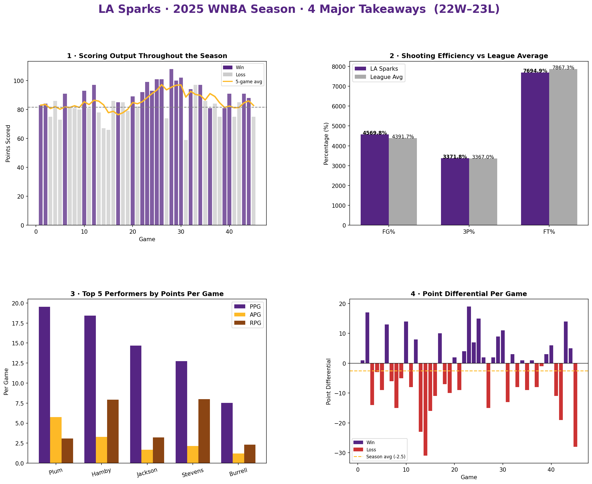

# LA Sparks 2025 — Season Performance Analysis

This project analyzes LA Sparks box score and game log data from the 2025 WNBA season
to evaluate scoring trends, shooting efficiency, player contribution, and game margins.

The goal is to demonstrate how statistical insights can support game preparation,
roster evaluation, and coaching decision-making heading into the 2026 season.

---

## Tools Used

- Python
- Pandas
- NumPy
- Matplotlib
- ESPN Public API (no key required)

---

## Key Questions

This analysis explores:

- How did the Sparks' scoring output trend across the season relative to league average?
- Where does LA's shooting efficiency (FG%, 3P%, FT%) stand compared to the rest of
  the league?
- Which players drove the most offensive production?
- What does the point differential distribution reveal about competitiveness and
  close-game performance?

---

## Key Findings

**The Sparks were a close-game team that couldn't finish.**
LA finished 22–23 with an average point margin of -2.5 — meaning most losses were
decided by a possession or less. The roster was competitive; execution in crunch time
was the separator.

**Kelsey Plum carried a disproportionate offensive load.**
Plum finished as the team's top scorer at 19.5 PPG. Without a consistent 15+ PPG
secondary option, opposing defenses could key in on her and limit the offense's
ceiling.

**Three-point efficiency was a drag on offensive rating.**
The Sparks shot 33.7% from three — below the threshold where high-volume
three-point shooting becomes a net positive. Improving this number or redistributing
shot selection would have a direct impact on offensive output.

**Free throw execution left wins on the table.**
At 76.9% from the line, late-game fouling situations became a liability rather than
an asset. In a season decided by margins of 1–5 points, free throw improvement
directly translates to wins.

---

## Visualization



---

## 2026 Points of Emphasis

| Priority | Focus Area | Rationale |
|---|---|---|
| 1 | Late-game execution | 22–23 record at -2.5 avg margin; games were there to win |
| 2 | Secondary scoring | Over-reliance on Plum makes offense one-dimensional |
| 3 | Three-point shot selection | 33.7% efficiency hurts more than it helps at high volume |
| 4 | Free throw consistency | 76.9% FT in close games is a winnable margin |

---

## Project Structure

```
wnba-stats-analysis/
│
├── assets/                  # Charts and visualizations
├── analysis.py              # Data fetch, analysis, and visualization
├── requirements.txt
└── README.md
```

---

## Run It

```bash
pip install -r requirements.txt
python analysis.py
```

Output is saved to `assets/sparks_2025_analysis.png`.
